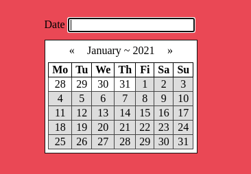

# Date Picker

A very simple date picker.  There are no
dependencies, and it is simply built with
JavaScript, HTML5, and CSS3.

## Installation

Because this is pure JavaScript, you simply
need to add the html within the date-picker-wrapper
in the html file, and add the JavaScript file
and css file to your work.  You'll need to
configure the date picker to work with your 
text input, and may need to format the date format
depending on the output you're looking for, 
but I think the code should be simple to work
with.

To change the format, just look at the
"fillMonth" function, and change the
value of the "dateValue" property of the 
"eachDayInMonth" object.

